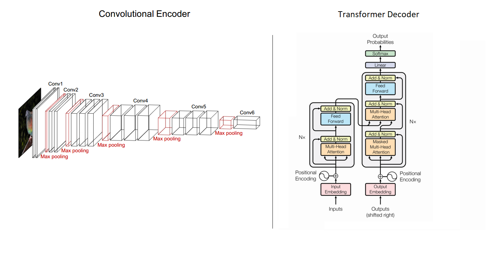
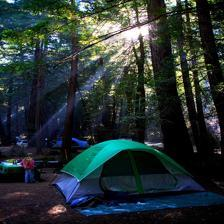
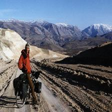
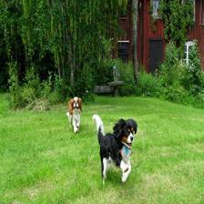
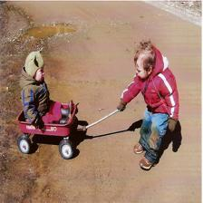

# Image Captioning

### Caption Images with Machine Learning

> deep-learning computer-vision cnn encoder-decoder autoencoder efficientnet sequence-modeling attention attention-mechanism nlp transformer tensorflow

This is an implementation of attention mechanism for image captioning. The model uses an autoencoder architecture, where a CNN (Efficientnet) acts as the encoder, and a Transformer acts as the decoeder.

The model extracts features/representations from an input image, and uses attention to generate a caption from relevant parts of these features.

- At each point of the output sequence, the token is generated only from parts of the input that are relevant, thanks to attention.

- Parallel processing gives The Transformer an upside over sequence attention models such as Bahdanau's Attention, because in sequence models, each point in the sequence is a bottleneck to all previous representations learned. This leads to inferior performance on longer sequences.

- 2D positional encoding enables the model to tell the structure of the image's features, and the part that corresponds to each pixel.

---
### Model Architecture

---
### Dataset
The [Flickr 8k Dataset](https://www.kaggle.com/datasets/adityajn105/flickr8k) was used.

---
### Preprocessing
Creating the vocabulary by sampling the top-k words/tokens from the dataset, makes the model learn on words that appear frequently in the dataset, and thus improves chance of convergence.

---
### Training
The encoder part of the model is a pretrained [EfficientNet](https://keras.io/api/applications/efficientnet/#efficientnetb0-function). The Transformer is trained by myself.
With a vocabulary size of 5000, an embedding size of 256, 4 encoder/decoder layers (Nx), and 8 heads, the model can take about 30 epochs to converge.

---
### Performance
Below are some of the predicted outputs.

> - **Image:** 
> - **Predicted:** Two young men and woman are playing with ball on the grass
> - **True:** Three kids play on wall with green ball

>  - **Image:** 
> - **Predicted:** The sun is blazing through the trees onto the grass
> - **True:** Tent and campsite in sunlit forest

>  - **Image:** 
> - **Predicted:** Two children are playing in the pool
> - **True:** Red haired girl making peace sign is wearing neon green glasses and floaties and playing in the pool with other kids

>  - **Image:** 
> - **Predicted:** Man is riding his bike on trail through the mountains
> - **True:** Male bicyclist on mountain road

>  - **Image:** 
> - **Predicted:** Two dogs play in field
> - **True:** Two dogs are running through the grass near house and trees

>  - **Image:** 
> - **Predicted:** Two children are playing with toy car
> - **True:** One child pulls another sitting in red wagon along the sand

>  - **Image:** 
> - **Predicted:** Two people are sitting on an unusual rock formation
> - **True:** Two people are sitting on huge rock formation

---
### Run the Model

This model has been deployed [to a mobile application](https://play.google.com/store/apps/details?id=com.apptasticmobile.captionthis). Feel free to use it if you do not have the python environment needed to run the source code.
